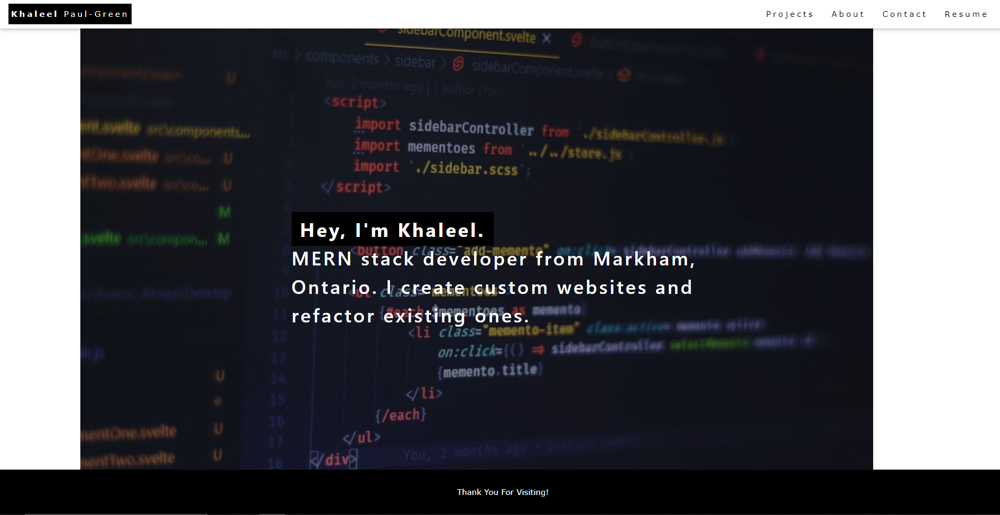
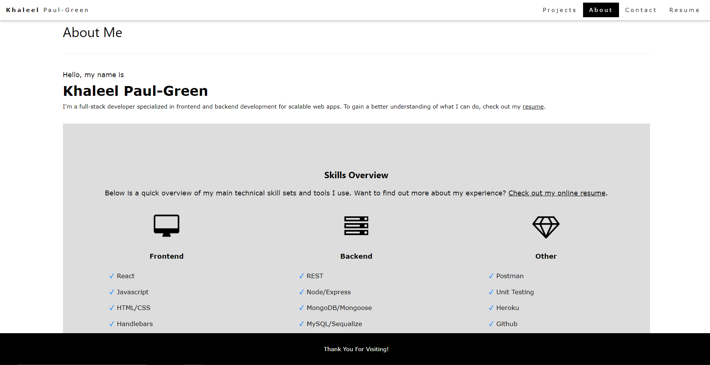

# React Portfolio
  ## Table of Contents
  * [Description](#description)
  * [Installation](#installation)
  * [Usage](#usage)
  * [License](#license)
  * [Contributors](#contributors)
  * [Questions](#questions)

  ## Description
Welcome to Spooky Sites, made by the Cobweb Coders! This application allows you to view the spooky sites in your local area. This is a full-stack application that is deployed on Heroku and uses the MVC paradigm, our own server-side API, has user authentication, and connects to a database.

  ## Installation 
  This app does not require an installation, and can be accessed via a web browswer [here](https://khaleelpaul-green.github.io/react-portfolio-updated/).

  However, if you would like to have this app forked, do `npm install` at the root directory and then run `npm start`

  ## Usage 
  Users can navigate the site to learn more of the company's projects, contact information, and values [here](https://khaleelpaul-green.github.io/react-portfolio-updated/).

## License
  This project is licensed under the MIT license.
  
  
  
  [License]((https://opensource.org/licenses/MIT)

  ## Contributors

  1. [Khaleel](https://github.com/khaleelpaul-green)

  ## Deployed Application

You can view the deployed application on Github Pages:
<https://spooky-sights.herokuapp.com/homepage>

Here are some screenshots for the application:

  ## Questions

  Github: [This Repo](https://github.com/khaleelpaul-green/react-portfolio-updated)\
  Email: [khaleelpaulgreen.code@gmail.com](mailto:khaleelpaulgreen.code@gmail.com).

Please feel free to contact me with comments or further questions via email, which is my prefered method.

